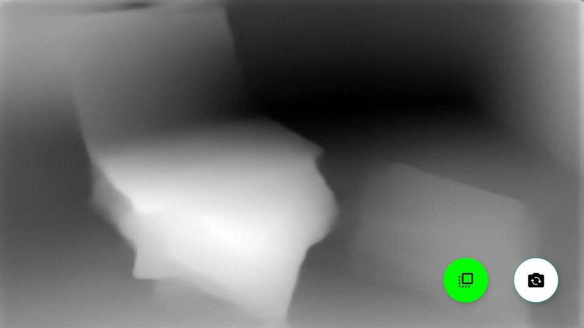
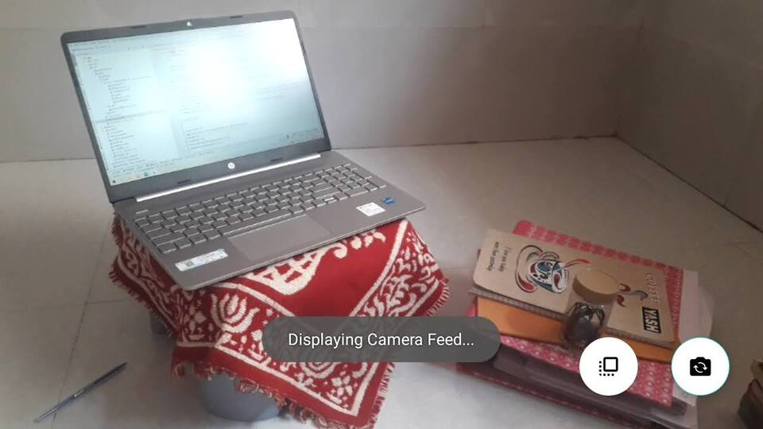

<div align="center">
  <h1>Realtime Depth Estimation In Android With MiDaS</h1>
</div>




* [Official MiDaS GitHub repo](https://github.com/isl-org/MiDaS)
* [TFLite model on TensorFlow Hub](https://tfhub.dev/intel/midas/v2_1_small/1)
* [APK for this project](https://github.com/shubham0204/Realtime_MiDaS_Depth_Estimation_Android/raw/master/app.apk)

The repository contains an Android project which uses the [MiDaS](https://github.com/isl-org/MiDaS) model to perform monocular
depth estimation. You can find the official Android example here -> https://github.com/isl-org/MiDaS/tree/master/mobile/android

This project uses the TFLite model from the [MiDaS's TensorFlow Hub repo](https://tfhub.dev/intel/midas/v2_1_small/1).
The following features are included in the project,

1. Well documented code with links to SO answers wherever required.
2. Uses latest APIs like [CameraX](https://developer.android.com/training/camerax) and [Kotlin Coroutines](https://developer.android.com/kotlin/coroutines).
3. No use of heavy packages like OpenCV to process and display the depth map. The application is coded in a
*Android* friendly manner.
4. Works for both front and rear camera and also in portrait and landscape orientations.

### Project info:

```
compileSdk 30
applicationId "com.shubham0204.ml.depthestimation"
minSdk 23
targetSdk 30
androidGradlePluginVersion 7.0.0
gradlePluginVersion 7.0.2
```


## Citation

```
@article{DBLP:journals/corr/abs-1907-01341,
  author    = {Katrin Lasinger and
               Ren{\'{e}} Ranftl and
               Konrad Schindler and
               Vladlen Koltun},
  title     = {Towards Robust Monocular Depth Estimation: Mixing Datasets for Zero-Shot
               Cross-Dataset Transfer},
  journal   = {CoRR},
  volume    = {abs/1907.01341},
  year      = {2019},
  url       = {http://arxiv.org/abs/1907.01341},
  archivePrefix = {arXiv},
  eprint    = {1907.01341},
  timestamp = {Mon, 08 Jul 2019 14:12:33 +0200},
  biburl    = {https://dblp.org/rec/journals/corr/abs-1907-01341.bib},
  bibsource = {dblp computer science bibliography, https://dblp.org}
}
```

## License

```
Copyright 2021 Shubham Panchal
Licensed under the Apache License, Version 2.0 (the "License");
You may not use this file except in compliance with the License.
You may obtain a copy of the License at

http://www.apache.org/licenses/LICENSE-2.0

Unless required by applicable law or agreed to in writing, software
distributed under the License is distributed on an "AS IS" BASIS,
WITHOUT WARRANTIES OR CONDITIONS OF ANY KIND, either express or implied.
See the License for the specific language governing permissions and
limitations under the License.
```
